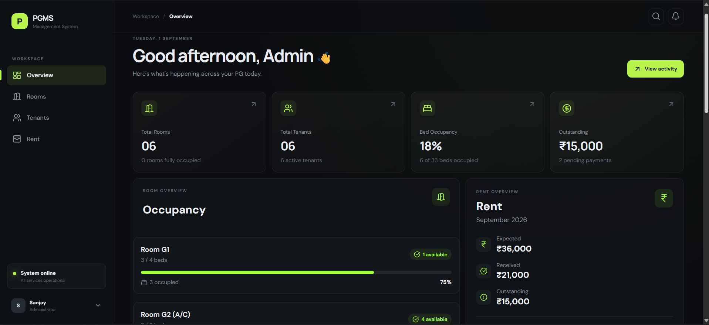
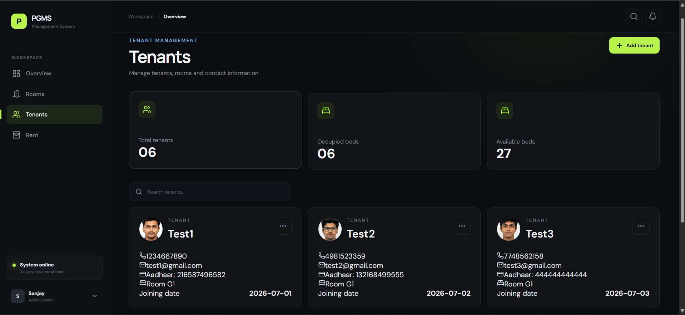
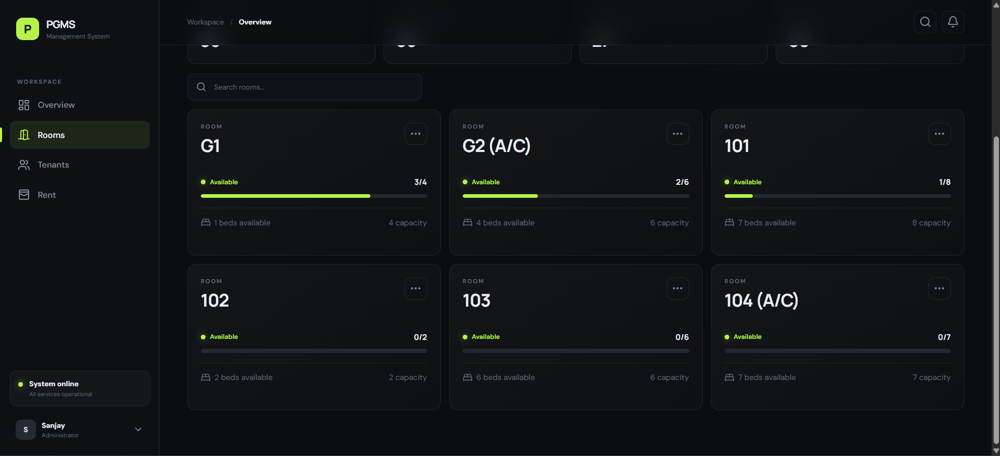
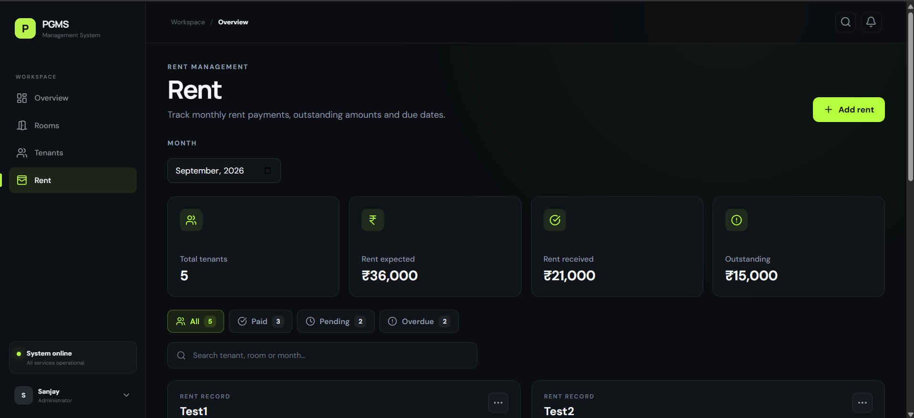

# 🏠 PG Management System

A full-stack web application designed to simplify PG (Paying Guest) accommodation management by providing a centralized platform for managing tenants, rooms, rent records, and daily activities.

🔗 **Live Application:** https://mypgmanager.vercel.app/

---

## 📌 Overview

The PG Management System is a full-stack application developed to replace manual PG management processes with a centralized digital solution.

The application allows administrators to manage tenant information, room allocation, rent tracking, occupancy details, and activity records through a responsive dashboard.

This project was developed using **Java Spring Boot for the backend, React.js for the frontend, and MySQL for data persistence.**

---

## 🚀 Features

### 👥 Tenant Management

* Add new tenants
* Edit tenant information
* Delete tenant records
* Upload tenant profile pictures
* Search tenants
* Assign tenants to rooms
* Store contact and identification details

### 🛏️ Room Management

* Add and manage rooms
* Configure room capacity
* Track occupied and available beds
* Assign tenants to rooms
* Monitor room occupancy

### 💰 Rent Management

* Track tenant rent records
* View paid and pending rent
* Track overdue and due-today payments
* View tenant-wise rent history
* Monitor monthly rent information

### 📊 Dashboard

* Total tenants
* Total rooms
* Occupied beds
* Available beds
* Rent statistics
* Recent activities

### 🔄 Activity Tracking

* Record important PG activities
* Display recent activities
* Monitor operational changes from the dashboard

### 🖼️ Tenant Profile Images

* Upload tenant profile pictures
* Image validation before upload
* Cloud-based image storage using Cloudinary

---

## 🛠️ Tech Stack

### Frontend

* React.js
* JavaScript
* HTML5
* CSS3
* Tailwind CSS
* React Router
* Axios
* Lucide React
* Motion

### Backend

* Java
* Spring Boot
* Spring Data JPA
* Hibernate
* REST APIs

### Database

* MySQL

### API Testing

* Postman

### Development Tools

* Git
* GitHub
* VS Code
* Eclipse IDE

### Cloud Services

* Vercel
* Render
* Aiven
* Cloudinary

---

## 🏗️ Architecture

The application follows a client-server architecture:

```text
                    ┌──────────────────────┐
                    │      React.js        │
                    │      Frontend        │
                    └──────────┬───────────┘
                               │
                               │ REST APIs
                               ▼
                    ┌──────────────────────┐
                    │     Spring Boot      │
                    │       Backend        │
                    └──────────┬───────────┘
                               │
                         Spring Data JPA
                               │
                               ▼
                    ┌──────────────────────┐
                    │        MySQL         │
                    │       Database       │
                    └──────────────────────┘

                         │
                         ▼
                    ┌──────────────┐
                    │  Cloudinary  │
                    │ Tenant Images│
                    └──────────────┘
```

---

## 📂 Project Structure

```text
pg-management-system/
│
├── BackEnd/
│   └── Spring Boot application
│       ├── Controller
│       ├── Service
│       ├── Repository
│       ├── Entity
│       └── Configuration
│
├── FrontEnd/
│   └── pg-management-system-frontend/
│       ├── src/
│       ├── components/
│       ├── pages/
│       ├── services/
│       └── assets/
│
├── .gitignore
└── README.md
```

---

## 📸 Screenshots

### Dashboard



### Tenant Management



### Room Management



### Rent Management




## 🌐 Deployment

| Component     | Platform   |
| ------------- | ---------- |
| Frontend      | Vercel     |
| Backend       | Render     |
| Database      | Aiven      |
| Image Storage | Cloudinary |

🔗 **Live Application:** https://mypgmanager.vercel.app/

---

## ⚙️ Local Setup

### 1. Clone the repository

```bash
git clone https://github.com/thess-sanjay/pg-management-system.git
```

```bash
cd pg-management-system
```

---

### 2. Backend Setup

Navigate to the backend:

```bash
cd BackEnd
```

Configure your database connection in:

```text
src/main/resources/application.properties
```

Example:

```properties
spring.datasource.url=jdbc:mysql://localhost:3306/pg_management
spring.datasource.username=root
spring.datasource.password=your_password

spring.jpa.hibernate.ddl-auto=update
spring.jpa.show-sql=true
```

Run the Spring Boot application using Eclipse, IntelliJ IDEA, or Maven.

---

### 3. Frontend Setup

Navigate to the frontend:

```bash
cd FrontEnd/pg-management-system-frontend
```

Install dependencies:

```bash
npm install
```

Start the development server:

```bash
npm run dev
```

The application will then be available through the local Vite development URL.

---

## 🔌 API Testing

REST APIs were tested using **Postman** during development.

Main API areas include:

```text
/api/rooms
/api/tenants
/api/rent
/api/dashboard
/api/activities
```

---

## 🔐 Environment Variables

Sensitive configuration values should be stored in environment variables instead of being committed to GitHub.

Example frontend environment variable:

```env
VITE_CLOUDINARY_CLOUD_NAME=your_cloud_name
```

Do not commit passwords, API keys, database credentials, or other secrets to the repository.

---

## 🎯 Learning Outcomes

Through this project, I gained practical experience in:

* Building RESTful APIs using Spring Boot
* Working with Spring Data JPA and Hibernate
* Designing relational database entities
* Connecting React.js with a Java backend
* Implementing CRUD operations
* Testing APIs using Postman
* Handling frontend-backend integration
* Deploying a full-stack application
* Working with cloud database services
* Managing source code using Git and GitHub

---

## 🔮 Future Improvements

Planned improvements include:

* Multi-admin support
* Multi-hostel management
* Role-based access control
* Advanced reporting
* Online rent payment integration
* Automated rent reminders
* Improved analytics and reporting

---

## 👨‍💻 Author

**Sanjay Saravanan**

MCA Graduate | Java Full-Stack Developer

🔗 Portfolio: https://sanjaydev.netlify.app/

🔗 LinkedIn: https://linkedin.com/in/imsanjaydev

🔗 GitHub: https://github.com/thess-sanjay

---

## ⭐ Project

If you find this project useful or interesting, consider giving the repository a ⭐ on GitHub.
